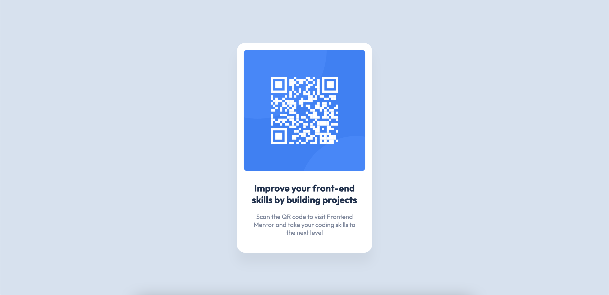

# Frontend Mentor - QR code component solution

This is a solution to the [QR code component challenge on Frontend Mentor](https://www.frontendmentor.io/challenges/qr-code-component-iux_sIO_H). Frontend Mentor challenges help you improve your coding skills by building realistic projects.

## Table of contents

- [Overview](#overview)
  - [Screenshot](#screenshot)
  - [Links](#links)
- [My process](#my-process)
  - [Built with](#built-with)
  - [What I learned](#what-i-learned)
  - [Continued development](#continued-development)
  - [Useful resources](#useful-resources)
- [Author](#author)

## Overview

### Screenshot

### Links

- Solution URL: [Add solution URL here](https://your-solution-url.com)
- Live Site URL: [Add live site URL here](https://your-live-site-url.com)

## My process

### Built with

- Semantic HTML5 markup
- CSS custom properties
- Flexbox

### What I learned

I used this project to refresh my basic HTML and CSS. I used semantic HTML, some custom properties, and flexbox. It was a great flexbox refresher, and I had a lot of fun building a [Frontend Mentor](https://nekocalc.com/px-to-rem-converter) project for the first time in over a year!

### Continued development

I would like to continue to improve my semantic, and accessible HTML use. I'm looking forward to building more Frontend Mentor Projects, and within a few months I would like to build a full-stack site from a project.

### Useful resources

- [Pixel to REM Converter](https://nekocalc.com/px-to-rem-converter) - This is a great resource I use on most projects for any conversions I might need.

## Author

- GitHub - [Brendan Madden](https://github.com/brendanmadden)
- Frontend Mentor - [@brendanmadden](https://www.frontendmentor.io/profile/brendanmadden)
- Twitter - [@BrendanMadden\_](https://www.twitter.com/BrendanMadden_)
